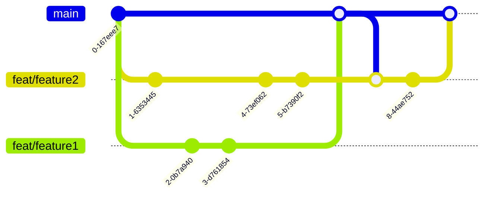

# Development

For all available commands checkout [quickstart.md](quickstart.md).

## Setup local dev environment

**Deployment**

You should start the miranum-deployment-proxy before running deployment commands.
If you want to deploy your artifacts to a "real" digiwf-engine. 
Edit in the [`application.properties`](../spring-boot-apps/miranum-deployment-proxy/miranum-deployment-proxy-example/src/main/resources/application.properties) the deployment handlers to use the `RestHandler`.

```bash
## build
# npm run build
npx nx build digiwf-deplyoment-proxy

## execute
npx nx serve miranum-deployment-proxy
```

The deployment test commands:

```bash
## build
# npm run build
npx nx build miranum-cli

## execute
npx nx deploy miranum-cli
```

**Generate**

```bash
## build
# npm run build
npx nx build miranum-cli

## execute
npx nx create miranum-cli
npx nx createProject miranum-cli
```

## Branching



## CI/CD

**Feature Branch**
After every commit the *test* workflow is executed that runs the lint command and all available tests.

**Pull Request**
For every open Pull Request (PR) the *pr-labeler* workflow is executed that adds labels to the PR for every app, lib, spring-boot-app that was changed in the PR.
Additionally, PR to the main branch create a build by running the lint command, executing all tests and building the applications and libs.

**Release**
The release pipeline is triggered manually with workflow dispatch.
In the workflow dispatch window you can select which apps and libs you want to release.

> Note: Before releasing an app you should update the apps (or libs) version in its `packages.json` or `pom.xml`. 

Checkout [releases](releases.md) for more information.
