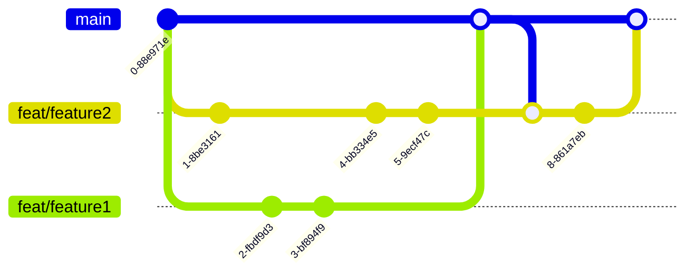

# Development

## Branching

## CI/CD

**Feature Branch**
After every commit the *test* workflow is executed that runs the lint command and all available tests.

**Pull Request**
For every open Pull Request (PR) the *pr-labeler* workflow is executed that adds labels to the PR for every app, lib, spring-boot-app that was changed in the PR.
Additionally, PR to the main branch create a build by running the lint command, executing all tests and building the applications and libs.

**Release**
The release pipeline is triggered on every git tag that is created in the format `v*.*.*`.
Checkout [releases](releases.md) for more information.
