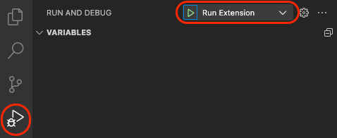

# Development

* [Setup local dev environment](#setup-local-dev-environment)
    * [Miranum VS Code Extension](#miranum-vs-code-extensions)
* [Testing](#testing)
* [Branching](#branching)
* [CI/CD](#cicd)
* [Autogenerated Docs](#autogenerated-docs)
* [Bundling](#bundling)


## Setup local dev environment

### Miranum VS Code Extensions

We provide several VS Code Extensions. You can find them under the [apps](../apps) folder.
In most cases, our extensions need a so-called [webview](https://code.visualstudio.com/api/extension-guides/webview).
The source code of the webview is maintained separately.
This means that <nobr>`miranum-<extension-name>`</nobr> and <nobr>`miranum-<extension-name>-webview`</nobr> form one VS
Code Extension.
To start an extension in development mode locally, you have to build the extension and webview.
Therefore, you can trigger the watch command:

```bash
# Auto rebuild the extensions on every change
npx nx observe-all miranum-<extension-name>
```

If not already done, you have to open this project with VS Code.
Then select *Run and Debug* and choose the extension (see the figure below).
Use the `F5` key or the debug menu option `Run Miranum ...` to start the Extension Development Host.
This will open a second window in which you can use/test the extension.



If the Extension Development Host is already running, you can update it with `cmd + r` on Mac (`crtl + r` windows/linux).

## Testing

We use [Jest](https://jestjs.io/) for testing our apps and libs. If you want to execute the tests use `npm run test`.
If you want to run the tests of a specific app or lib use `npx nx test <app|lib>`.

### Code Coverage Reports

We use CodeCov ([https://app.codecov.io/gh/Miragon/miranum-ide](https://app.codecov.io/gh/Miragon/miranum-ide)) to
visualize our code coverage.

If you want to check out the code coverage locally, execute the tests with the flag `--coverage` (
e.g. `npx nx run-many --target test --all --parallel --coverage`).

Checkout [tests](test.md) for more information on testing.

## Branching


## CI/CD

**Feature Branch**
After every commit, the *test* workflow is executed that runs the lint command and all available tests.

**Pull Request**
For every open Pull Request (PR) the *pr-labeler* workflow is executed that adds labels to the PR for every app, lib that was changed in the PR.
Additionally, PR to the main branch create a build by running the lint command, executing all tests and building the
applications and libs.

**Release**
The release pipeline is triggered manually with workflow dispatch.
In the workflow dispatch window you can select which apps and libs you want to release.

> Note: Before releasing an app you should update the apps (or libs) version in its `packages.json` or `pom.xml`.

Checkout [releases](releases.md) for more information.

## Bundling

We use vite and webpack to build and bundle the applications and libs.

- **Vite** for web apps (e.g. react apps)
- **Webpack** for vscode and nodejs apps
