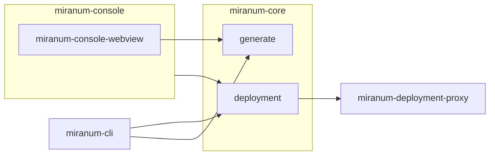

# Development

For all available commands checkout [quickstart.md](quickstart.md) and [commands.md](commands.md).



## Setup local dev environment

### Miranum-Deployment-Proxy

You should start the miranum-deployment-proxy before running deployment commands.
If you want to deploy your artifacts to a "real" digiwf-engine. 
Edit in the [`application.properties`](../spring-boot-apps/miranum-deployment-proxy/miranum-deployment-proxy-example/src/main/resources/application.properties) the deployment handlers to use the `RestHandler`.

```bash
## build
# npm run build
npx nx build miranum-deplyoment-proxy

## execute
npx nx serve miranum-deployment-proxy
```

### Miranum-CLI

```bash
# shows help page
npx nx serve

# Deployment domain
npx nx deploy miranum-cli

# Generate domain
# Resources are generated into directory: resources/my-generations
# Note: nx generate is a built in command, therefore we had to name our custom command create
npx nx create miranum-cli
```

### Miranum-Console

In order to start the miranum-console extension in development mode locally, you have to build the extension and webview.
Therefore, you can trigger the watch command:
```bash
# Auto rebuild the extensions on every change
npm run watch

# or manually:
npx -c 'nx watch --projects=miranum-console,miranum-console-webview -- npx nx build \$NX_PROJECT_NAME'
```
Then use the `F5` key or the debug menu option `Run Miranum Console` to start the Extension Development Host.

> Note: Even though builds will be generated automatically, you have to close and reopen the webview in the Extension Development Host.

## Testing

We use [Jest](https://jestjs.io/) for testing our apps and libs. If you want to execute the tests use `npm run test`.
If you want to run the tests of a specific app or lib use `npx nx test <app|lib>`.

### Code Coverage Reports

We use CodeCov ([https://app.codecov.io/gh/FlowSquad/miranum-ide](https://app.codecov.io/gh/FlowSquad/miranum-ide)) to visualize our code coverage.

If you want to check out the code coverage locally, execute the tests with the flag `--coverage` (e.g. `npx nx run-many --target test --all --parallel --coverage`).

Checkout [tests](test.md) for more information on testing.

## Branching


## CI/CD

**Feature Branch**
After every commit the *test* workflow is executed that runs the lint command and all available tests.

**Pull Request**
For every open Pull Request (PR) the *pr-labeler* workflow is executed that adds labels to the PR for every app, lib, spring-boot-app that was changed in the PR.
Additionally, PR to the main branch create a build by running the lint command, executing all tests and building the applications and libs.

**Release**
The release pipeline is triggered manually with workflow dispatch.
In the workflow dispatch window you can select which apps and libs you want to release.

> Note: Before releasing an app you should update the apps (or libs) version in its `packages.json` or `pom.xml`. 

Checkout [releases](releases.md) for more information.
