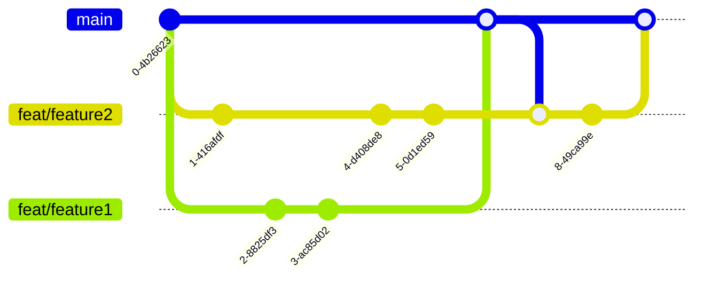

# Contributor Guide

- [Prerequisites](#prerequisites)
- [Setup](#setup)
- [Project Structure](#project-structure)
- [Development Workflow](#development-workflow)
- [Testing & Linting](#testing--linting)
- [Code Style](#code-style)
- [Branching & Commits](#branching--commits)
- [CI/CD](#cicd)
- [Architecture Overview](#architecture-overview)

## Prerequisites

- **Node.js** v20 or later
- **corepack** enabled: `corepack enable`
- **VS Code**

## Setup

```bash
yarn install
```

## Project Structure

This is a Yarn 4 workspace monorepo containing a single VS Code extension (Camunda
Modeler) and its supporting packages:

| Workspace              | Path                  | Description                           |
|------------------------|-----------------------|---------------------------------------|
| `vs-code-bpmn-modeler` | `apps/modeler-plugin` | VS Code extension host (Node/Webpack) |
| `bpmn-webview`         | `apps/bpmn-webview`   | BPMN editor UI (Vite/browser)         |
| `dmn-webview`          | `apps/dmn-webview`    | DMN editor UI (Vite/browser)          |
| `@bpmn-modeler/shared` | `libs/shared`         | Shared message types and utilities    |

## Development Workflow

### Build

```bash
# Build everything (libs → webviews + plugin in parallel)
yarn build

# Build only the shared libraries
yarn build:libs
```

### Watch mode

```bash
# Rebuild all workspaces on change
yarn dev
```

### Run the extension in VS Code

1. Open the repository root in VS Code.
2. Run `yarn dev` to start watch mode.
3. Open the **Run and Debug** panel and select **"Run modeler-plugin"**.
4. Press **F5** to launch the Extension Development Host.

To reload the extension host after a change, press **Cmd+R** (macOS) or **Ctrl+R** (
Windows/Linux).

### Target a single workspace

```bash
yarn workspace vs-code-bpmn-modeler build
yarn workspace bpmn-webview build
```

## Testing & Linting

```bash
# Run all tests (includes coverage by default)
yarn test

# Run a single test file
yarn test --testPathPattern=apps/modeler-plugin/src/service/bpmnUtils.spec.ts

# Lint
yarn lint
```

Coverage reports are uploaded
to [Codecov](https://app.codecov.io/gh/Miragon/bpmn-vscode-modeler)
on CI.

## Code Style

| Tool             | Configuration       | Key rules                                           |
|------------------|---------------------|-----------------------------------------------------|
| **EditorConfig** | `.editorconfig`     | 4-space indent, LF line endings, max 89 chars       |
| **Prettier**     | `.prettierrc`       | Double quotes, trailing commas, arrow parens always |
| **ESLint**       | `eslint.config.mjs` | TypeScript strict                                   |

Prettier and ESLint are enforced by the lint step in CI.

## Branching & Commits

### Branching model


```mermaid
gitGraph
    commit
    branch feat/feature2
    checkout feat/feature2
    commit
    checkout main
    branch feat/feature1
    checkout feat/feature1
    commit
    commit
    checkout feat/feature2
    commit
    commit
    checkout main
    merge feat/feature1
    checkout feat/feature2
    merge main
    commit
    checkout main
    merge feat/feature2
```

### Commit messages

Use semantic commit messages scoped to the affected workspace:

```
feat(bpmn): add token simulation toolbar
fix(dmn): correct decision table rendering
chore(shared): update message type definitions
```

Common types: `feat`, `fix`, `refactor`, `chore`, `docs`, `test`.

## CI/CD

| Workflow       | Trigger                                | Steps                                                           |
|----------------|----------------------------------------|-----------------------------------------------------------------|
| **Build**      | Every push / PR                        | lint → test → build                                             |
| **PR Labeler** | PR opened/updated                      | Auto-labels PRs by changed workspace                            |
| **Release**    | Manual (`workflow_dispatch` on `main`) | Bump version → build → package `.vsix` → publish to Marketplace |

## Architecture Overview

The extension uses a **flat service architecture** with plain constructor wiring — no DI
framework.

```
apps/modeler-plugin/src/
  domain/         # Pure domain types — no external dependencies
  infrastructure/ # VS Code API adapters (EditorStore, VsCodeDocument, …)
  service/        # Business logic (BpmnModelerService, ArtifactService, …)
  controller/     # VS Code events → service calls
  main.ts         # Wiring: EditorStore → VsCode* → Services → Controllers
```

Key design decisions:

- **Echo prevention**: each open editor gets a `ModelerSession` guard that blocks the
  `onDidChangeTextDocument` echo caused by the extension's own document write.
- **Element template discovery**: convention-based — no project config file needed.
  Templates are resolved under `<configFolder>/element-templates/` walking up from the
  BPMN file to the workspace root.
- **Webview communication**: `postMessage` with typed message contracts defined in
  `libs/shared`.

See [`CLAUDE.md`](../CLAUDE.md) for the full architectural reference.
