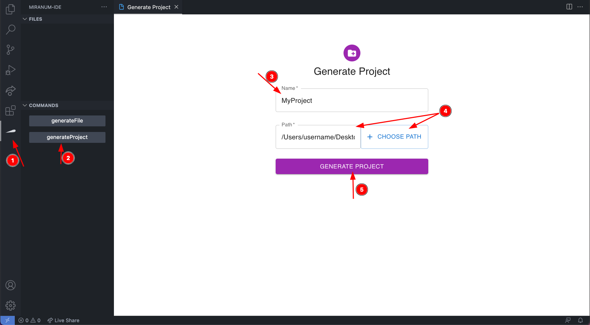
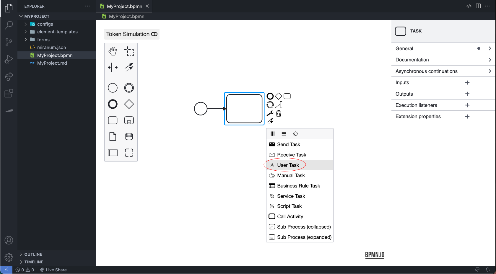
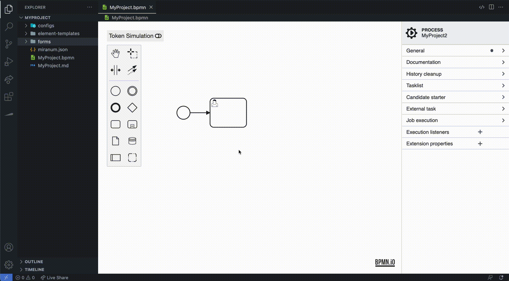
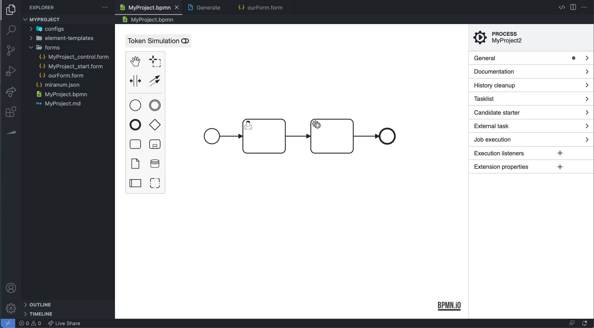
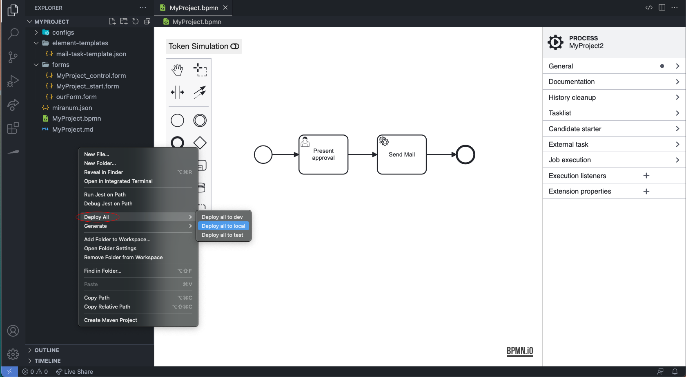

# Getting Started with <h style="font-family: Academy Engraved LET; color:#00E676">Miranum</h>

## Setup
Before being able to use the full potential Miranum offers you also need to download the following Extensions:

[Miranum: BPMN-Modeler](https://marketplace.visualstudio.com/items?itemName=miragon-gmbh.vs-code-bpmn-modeler) \
[Miranum: Form](https://marketplace.visualstudio.com/items?itemName=miragon-gmbh.vs-code-vuetify-jsonschema-builder)

## Steps to your first BPMN-Project
Open the Miranum-Console on the side-bar and generate your first Project.
All you need to do is input a name and select the path you want it to be saved to.

Now that we have our base project set up we can start modeling. 
Therefore, open the path you selected in the VS-Explorer and open the .bpmn file.
You should see an almost empty diagram. Let's extend this a bit and add a Task to it.
If we now click the element again and use the wrench on it, we can make it a UserTask.

Here comes our first feature. If you use Camunda a lot, you already know the Form-Property.
With Miranum however, we now enable you to skip the process of remembering Form-keys and instead directly select one out of your collection.
Let's say we don't want one of the forms we already have and need to make a new one. No Problem.
Go back to the Miranum-Console, but this time generate a File and select type="form".

The newly generated form file will be automatically added into your form-folder and can therefore be used in the select field.
But we aren't done yet, we want to edit the form. Therefore, double click it.
The extension should give you a new editor window. You should see a builder and a JSON-Schema preview.
Let's first concentrate on the builder, and drag a group and then a textfield into one of the groups. 
In the preview you shoud now see a change, if not press the refresh button in its top right corner.
Great Job, we made our first form! It's quite simple at the moment, so let's enhance it by adding a number and then a switch into the same group.

Let's rename some segments. First, press the Options-Button (three dots on the right) of the textfield and press Edit. 
A new window should pop up. This should have a lot of options to it, we only want to change the name though, so let's change the title to "Article".
Let's do the same with our number -> "Price", and our switch -> "Approve".
Amazing, we have a full functioning form which we can now integrate into our bpmn-diagram.
So, let's do that. Open your bpmn again, and select your UserTask. 
Now select the newly generated form in your form-property. This should fill out an input-variable for you.

 //after update digiwf

Let's add another Task to our diagram and then finish the diagram with the "End Event" block.
Now make the Task a ServiceTask. (In case you forgot how to do it: click on the Task, press the wrench, and select ServiceTask)

This is the final diagram (Does yours look the same?):

Let's do some more editing though. First, select the "Select"-button on the Template property of the Service-Task.
This should open a window with your available Templates. Now choose the "Mail Task" and fill out custom properties.
As recipient use your email. As content say "hi". As subject put "present".

Let's also change the name of our elements. Anyone who knows his way around Camunda can do this by themselves.
If you haven't used Camunda yet, naming is done under the property General -> Name.
Let's try this for our UserTask. Let's name it "Present approval". We do the same with the ServiceTask, but this time we give it the name "Send Mail".

 //after bpmn update (as email: yourName@miragon.io)

That's us done, now we can deploy our new creation. To do this, you can either right-click the Project-folder and say DeployAll.
Or you can go back to the Miranum-Console, and use the DeployAll button there.

