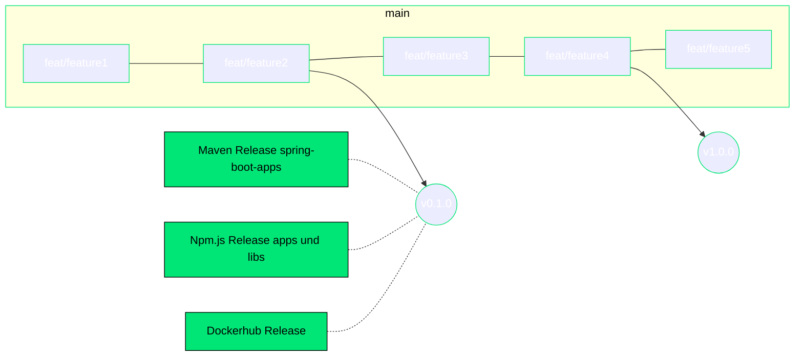

# Releases

## Create a new release

Before you release a new version make sure to edit the projects version in its `package.json` and `pom.xml`.

Go to the [actions section in github](https://github.com/FlowSquad/miranum-ide/actions/workflows/release.yml) and trigger the `release.yml` action manually.
In the workflow dispatch window you can select the apps and libs you want to publish.
Additionally, you can name the release to automatically create a tag in github.

### Versions

We follow a single version approach for all typescript apps and libs.
The version of vs-code extensions, cli app and libs is defined in the [package.json](../package.json).

> Note: Only the version in the root package.json counts.
> The versions in all other apps and libs package.json is automatically added with the script [set-version.js](../tools/scripts/set-version.js).

The version of spring-boot-apps is defined for every app in a pom.xml.
Spring boot apps (java) and the typescript apps and libs are not versioned together (they don't share the same version). 
