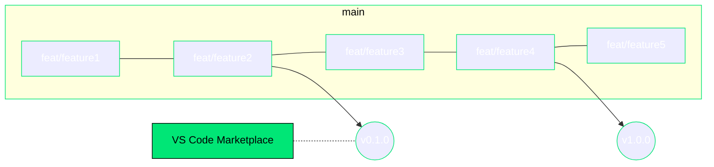

# Releases

```mermaid
flowchart LR
    %% declarations
    feat1[feat/feature1]
    feat2[feat/feature2]
    feat3[feat/feature3]
    feat4[feat/feature4]
    feat5[feat/feature5]

    v0.1((v0.1.0))
    v1((v1.0.0))

    marketplace[VS Code Marketplace]

    %% style
    style feat1 stroke:#00E676,background-color:black,color:white
    style feat2 stroke:#00E676,background-color:black,color:white
    style feat3 stroke:#00E676,background-color:black,color:white
    style feat4 stroke:#00E676,background-color:black,color:white
    style feat5 stroke:#00E676,background-color:black,color:white
    style v0.1 stroke:#00E676,background-color:black,color:white
    style v1 stroke:#00E676,background-color:black,color:white
    style marketplace fill:#00E676,color:black,stroke:black
    style main stroke:#00E676,color:black

    %% graphs
    subgraph main
        feat1---feat2
        feat2---feat3
        feat3---feat4
        feat4---feat5
    end

    feat2-->v0.1
    feat4-->v1

    marketplace-.-v0.1
```

## Create a new release

Releases are triggered manually via [GitHub Actions](https://github.com/Miragon/miranum-ide/actions/workflows/release.yml).

### Steps

1. Go to the **Actions** tab → **Release** workflow → **Run workflow**.
2. Select the **release type**:
   - `patch` — bug fixes (0.0.x)
   - `minor` — new features, backwards-compatible (0.x.0)
   - `major` — breaking changes (x.0.0)
3. Optionally enable **Dry run** to validate the pipeline without committing, tagging, or publishing.
4. Click **Run workflow**.

### What the workflow does

1. Bumps the version in `apps/modeler-plugin/package.json` according to the selected release type.
2. Runs lint, tests, and build.
3. Packages the extension as a `.vsix` file.
4. Commits the version bump, creates a git tag (`vX.Y.Z`), and pushes to `main`.
5. Creates a GitHub Release with auto-generated release notes and attaches the `.vsix`.
6. Publishes the extension to the VS Code Marketplace.

> The workflow only runs on the `main` branch. Dry-run mode skips steps 4–6.
