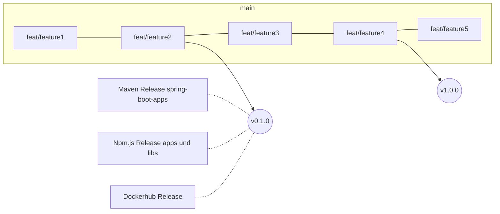

# Releases



## Create a new release

For each release we create a tag (vx.x.x) in git.
Every new tag triggers the github action release pipeline and publishes the new version to npm, maven and dockerhub.

```
git tag -a v1.0.0 -m "Release version v1.0.0"
git push origin v1.0.0
```

The version specified in the tag is responsible for the version that is released to external systems (e.g. maven, npm.js, dockerhub, ...).

> The versions of all apps and libs are always the same even though nothing changed.
